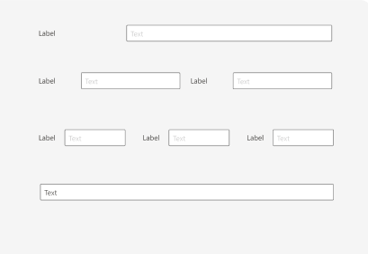
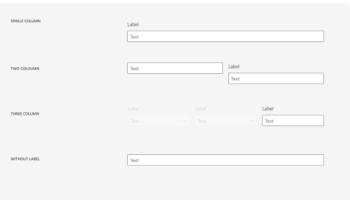
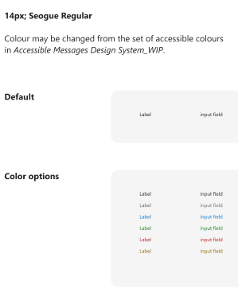
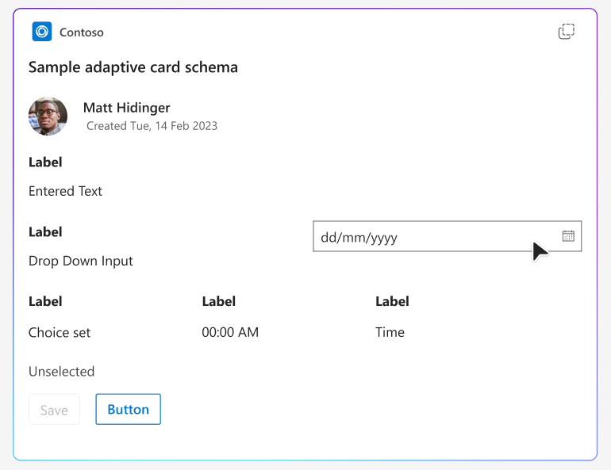
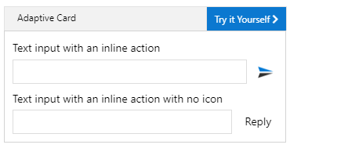

## Inline Editability for Adaptive Cards

### Overview

Adaptive cards are used by apps to share information as well as to collect input from users to complete user scenarios.
As of now, if we are showing some information in a card and we also want to collect user’s input, we will have bunch of Input fields hidden behind a ShowCard button or we will launch some form using button click on the card to collect user's input.
In both cases we might have duplicate readable fields and input fields.

We want to provide better experience to the user where he can read the fields and can also seamlessly update the values at the same place. 

UI of showing data and taking user input will become simplistic. 

 
### Current experience:

As shown in the below picture, An adaptive card displays data for Customer name, Est. Revenue and Est. Clode Date. If user wants to update those information, he will have to click on 'Edit' button which will open some form and there he can update values for 'Est. Revenue' etc. and Click on Save to send data back to the bot service.


As of now, Adaptive cards support `Input` fields to collect user input. This is how current user experience of `Input` fields looks like. 

 

### Proposed experience:

We will allow bot developer to enhance the user experience of all `Input` fields in Adaptive card (such as `Input.Text`, `Input.Number`, `Input.Date`, `Input.Time`, `Input.Toggle` and `Input.Choiceset`) in way that, these input fields can appear just as readable fields when user is not taking any action and when user clicks or focusses or clicks on them, it allows user to update those fields and then user can use action buttons like Action.Submit/Action.Execute to send data back to the bot.

This is the flow for user to interact with inline editable fields:-
1. This is an adaptive showing information like "Contact", "Email", "Est. Closing date" etc. with inline Editable style where input fields are displayed as **readable fields** in the **default** state.


2. When user hovers on the card, 
	* we will show outer outline on that card.
	* we will show a lighter color outline to all the input fields which are inline editable.
	
	This will guide user to the input fields which he can go an update right on the card.
	


3. When user takes hovers over the input field, we will show a darker outline in that input field to guide user that the field is activated and he can now edit the field.


4. User can go and edit the field.


5. When user has updated the input field, Action.Submit or Action.Execute button such as "Save" which has  `disabledUnlessAssociatedInputsChange` property (https://github.com/microsoft/AdaptiveCards/issues/7103) will get enabled automatically. It will guide user to hit the button to commit the changes made on the card.


6. When user clicks hits on the Action.Submit or Action.Execute button, latest input values will be sent to the bot from host and bot can then update the card with latest information which we will show in default state.


### New Capabilites in the card:
In order to achieve inline editable experience as mentioned above, we will add these capabilities in the card for developers and host:

#### Schema Changes in Adaptive Card:
1. Introduce an optional styling property in AC input fields schema for developer to choose between existing input fields styling vs inline editable styling.

* **Existing view:**

 

* **Inline Editable View:**


2. Introduce an optional new styling property in AC input fields schema which will allow developers to define if label of the input and the input field would be vertically or horizontally aligned. Default would be existing vertical. This feature will be independent of whether input fields are inline editable or not. We will allow horizontal view for default input fields as well.
	*Note*: When card width is small due to browser resize etc, horizontal view can shift to vertical view of input fields.

* **Vertical view:**


* **Horizontal view:**


#### Host configurable properties in card:
1. Host can configure styling property to define width percentage of label and value properties for input elements. 
In horizontal view, by default, label:value width is to be 3:7 of the container of input element. however, host can configure it for themselves.



In vertical view, the width is always 100% of the container of input element.




2. Host can configure these style properties of `label` and `value` field: `font`, `font color` and `font weight`. 
	Default (for both label and value): `14px; Seogue Regular`.
	Colour may be changed from the set of accessible colours in Accessible Messages Design System_WIP



#### Use Case Clarifications:

1. If `label` is `empty` in the input field then value takes 100% width of the container of the input element.

2. If `value` is `empty` in the input field. We will show label and placeholder text in lighter color like this in the [default] state,


which user can go and update the value,


3. If `label` is `empty`, we will just show `value` field in readable format in the default state which user can go and update the value.



4. Order of `label` and `value` will always be label first and value second. In RTL, it should follow right to left convention as expected.


5. If user has some unsaved changes on the card but he moved away from the card but card is still in the viewport. In this case, we will preseve the changes made by the user and we will some indication to user that fields are unsaved or dirty. When card goes out of the viewport, then we wont preserve the unsaved values.

#### Developer Recommendation:

1. **Save Button:** Our recommendation is to have a `Save` button (Action.Submit or Action.Execute) with `disabledUnlessAssociatedInputsChange` on the card with inline editable fields. Save button will send the modified user input values to the bot and bot will respond with a card with updated input values.

2. **Cancel Button:** Our recommendation is to have a `Cancel` button (Action.Submit or Action.Execute) on the card with inline editable fields. If user has made some changes in the input fields but want to revert back to original state, they can click on "Cancel" button. "Cancel" button will send the card with last saved input values.
#### Out of Scope:

1. Inline Action in Input.text: We will not support inline Editable styles for input text containing inline action. It will be shown as default input style only. Reason being, such sceanrios are reply with a comment or adding a message where user collaboration is not needed.



2. Mobile is `out of scope` for inline editable design since there is no focus state on mobile and alignment will be always `vertical` as of today.

### Schema Changes:

 1. Inherited properties of all Input fields will have one more property called `inputStyle` whose type will be `InputStyle`

| Property | Type | Required | Description | Version |
| -------- | ---- | -------- | ----------- | ------- |
| **inputStyle** | `InputStyle?` | No | style hint for Input fields | 1.7 |


#### inputStyle

Style hint for input fields.

* **Type**: `InputStyle`
* **Required**: No
* **Allowed values**:
  * `"readWrite"` : Should show input fields as inline editable field, which is showing them in readable view unless user takes any action.

Since this property is inherited to all Input fields, it will be supported by all:

* `Input.Text`
* `Input.Number`
* `Input.Date`
* `Input.Time`
* `Input.Toggle`
* `Input.Choiceset`

#### Sample Payload:

```json
     {
          "type": "Input.Text",
          "label": "Name",
          "value": "Sneh",
          "inputStyle" : "readWrite"
      },
      {
          "type": "Input.Time",
          "label": "Time of Arrival",
          "value": "09:30",
          "inputStyle" : "readWrite"
      },
      {
          "type": "Input.Number",
          "label": "Number of Guest",
          "value": 5,
          "inputStyle" : "readWrite"
      }	
```

2. Inherited properties of all Input fields will have one more property called `labelAlignment` whose type will be `InputLabelAlignment`

| Property | Type | Required | Description | Version |
| -------- | ---- | -------- | ----------- | ------- |
| **labelAlignment** | `InputLabelAlignment?` | No | Determines the alignement of the label with respect to the input field. Default is vertical when not specified | 1.7 |

#### InputLabelAlignment

Alignment for label in input fields.

* **Type**: `InputLabelAlignment`
* **Required**: No
* **Allowed values**:
  * `"vertical"` : should place label vertically on top of the input field.
  * `"horizontal"` : should place label horizontally on left (or right in RTL setting) of the input field.
  
#### Sample Payload:

```json
     {
          "type": "Input.Text",
          "label": "Name",
	  "value": "Sneh",
	  "inputStyle" : "readWrite",
	  "labelAlignment" : "vertical"
      },
      {
          "type": "Input.Time",
          "label": "Time of Arrival",
          "value": "09:30",
	  "inputStyle" : "readWrite",
          "labelAlignment" : "horizontal"
      },
      {
          "type": "Input.Number",
          "label": "Number of Guest",
          "value": 5,
          "labelAlignment" : "horizontal"
      },
      {
          "type": "Input.Text",
          "label": "Flight origin",
          "value": "Seattle",
          "labelAlignment" : "vertical"
      },
      {
          "type": "Input.Text",
          "label": "Flight destination",
	  "value": "Hyderabad",
      }	
```


